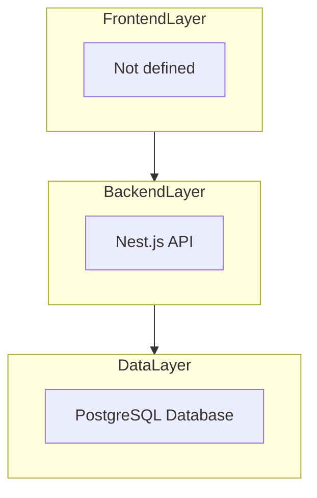
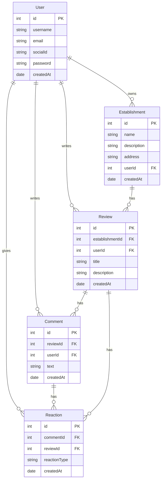

## Table of contents

- [introduction](#1-introduction)
- [Goals and Objectives](#2-goals-and-objectives)
- [Scope](#3-scope)
- [Functional Requirements](#4-functional-requirements)
- [Architecture](#5-architecture)
- [Data Model](#6-data-model)
- [API Documentation](#7-api-documentation)

## **1. Introduction**

The Nata is a web-based review and recommendation platform for restaurants, bars and cafes provided by the user community of the platform. This document outlines the design and architecture of the backend services only, with no insight of how UX/UI will work.

The idea is for the users to follow reviewers that interest them and have similar tastes so they can try all the places their favorite reviewers recommend.

## **2. Goals and Objectives**

- Provide endpoints that will allow users to create reviews and recommendations based on establishments that they have visited before.
- Allow users other than reviewers to interact with these reviews and share their opinion of the reviews
- Support multiple users with secure authentication.

## **3. Scope**

The initial scope of the project includes:

- User registration and login (social sign in only)
- CRUD operations to manage establishments
- CRUD operations to manage reviews
- CRUD operations to comment existing reviews
- CRUD operations to react to existing reviews and comments

## **4. Functional Requirements**

### **User Management:**

- Users should be able to register with social sign in
- Users should be able to login with social sign in

### **Establishment Management:**

- Users should be able to create establishments
- Users should be able to list establishments

### **Review Management:**

- Users should be able to create, update, delete  their own reviews
- Users should be able to list reviews per establishment

### **Comment Management:**

- Users should be able to create, update and delete their own comments regarding the review
- Users should be able to list other comments per review

### **Reactions Management**

- Users should be able to react positively or negatively to any comment or review
- Users should be able to list reactions per comment or review

## **5. Architecture**

The Nata Application follows a three-tier architecture:

- Frontend Layer: Not defined
- Backend Layer: Backend API using REST built with Nest.js to handle logic and data access.
- Data Layer: PostgresSQL database for storing user accounts, establishments, reviews and comments data

## **6. Data Model**

The application consists of four main entities:

1. User: Stores user account information.
2. Establishment: Stores establishment details such as name, description, address and user ID.
3. Reviews: Stores review information such as establishment, user ID, title and description
4. Comments: Stores comments information such as review ID, user ID, text and date
5. Reactions: Stores reactions information such as comment ID, review ID, and reaction

## **7. API Documentation**

The backend API exposes the following endpoints:

### Users

- `POST /api/users/register` Register a new user
- `POST /api/users/login` Log in an existing user

### Establishment

- `GET /api/establishment` Retrieve all establishments
- `GET /api/establishment/{establishmentId}` Retrieve specific establishment
- `POST /api/establishment` Create a new establishment
- `PATCH /api/establishment/{establishmentId}`Update an existing task (this will be locked in the future)
- `DELETE /api/establishment/{establishmentId}` Delete an establishment (this will be locked in the future)

### Review

- `GET /api/establishment/{establishmentId}/review` Retrieve all reviews from establishment
- `GET /api/establishment/{establishmentId}/review/{reviewId}` Retrieve specific review from establishment
- `POST /api/establishment/{establishmentId}/review` Create a review for an establishment
- `PATCH /api/establishment/{establishmentId}/review/{reviewId}` Update a review
- `DELETE /api/establishment/{establishmentId}/review/{reviewId}` Delete a review

### Comment

- `GET /api/review/{reviewId}/comment` Retrieve all comments from review
- `GET /api/review/{reviewId}/comment/{commentId}` Retrieve all comments from review
- `POST /api/review/{reviewId}/comment/{commentId}` Create a comment for a review
- `PATCH /api/review/{reviewId}/comment/{commentId}` Update a comment
- `DELETE /api/review/{reviewId}/comment/{commentId}` Delete a comment

### Reaction

- `GET /api/review/{reviewId}/reaction` Retrieve all reactions from review
- `GET /api/comment/{commentId}/reaction` Retrieve all reactions from comment
- `PATCH /api/review/{reviewId}/reaction` Create a reaction for a review
- `POST /api/comment/{commentId}/reaction` Create a reaction for a comment
- `DELETE /api/reaction/{reactionId}` Delete a reaction
